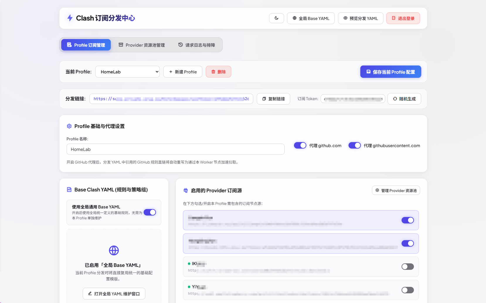
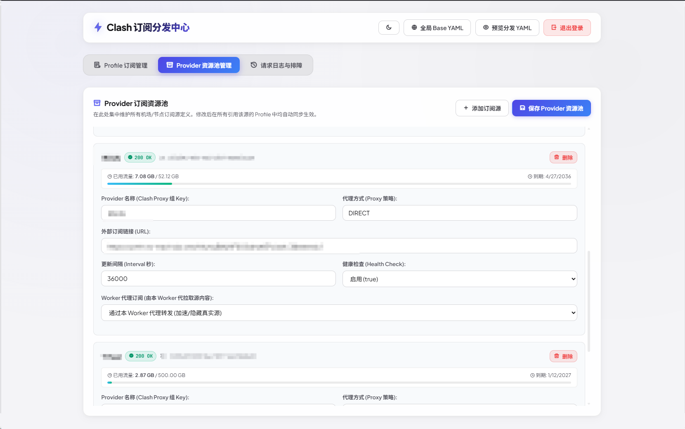
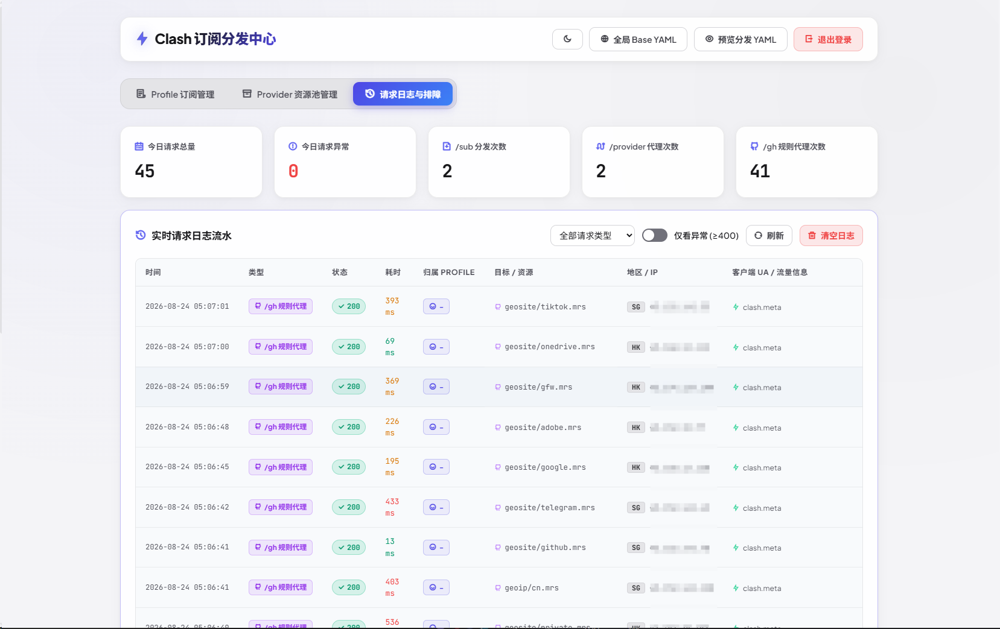

# ⚡ Clash 订阅分发中心 (mySubs)

基于 **Cloudflare Workers** + **Cloudflare D1 (主数据库)** + **KV (边缘缓存)** + **Web Crypto (AES-256-GCM / HMAC)** 构建的现代化、全功能、免运维 Clash 订阅管理与全链路代理分发中台。

---

## 📸 界面预览

### 1. Profile 订阅配置管理
> 支持多 Profile 租户隔离、独立 64 位 Token、全局 / 独立 Base YAML 自由切换与订阅节点源按需勾选。



---

### 2. Provider 节点资源池管理
> 集中统一管理多家机场订阅，支持直连与 Worker 边缘反代两种模式，自动解析节点流量使用情况（已用/总流量/到期时间）与健康检测状态。



---

### 3. 实时请求统计与排障流水
> 今日请求量/异常量看板、分类型流量统计、毫秒级耗时监控、归属 Profile 标记、目标资源定位、客户端国家地区/IP 单行解析与 UA 悬浮详情。



---

## 🌟 核心特性

1. **D1 SQLite 单体真理层 + KV L1 极速边缘缓存**：
   - **Cloudflare D1**：持久化存储 Profile 订阅配置、Provider 节点资源池、Base YAML 规则与请求日志，彻底摆脱 KV 写入限制与并发冲突。
   - **Cloudflare KV**：充当 L1 边缘极速读缓存，保障客户端订阅拉取毫秒级响应。
   - **软删除（Soft Delete）机制**：删除 Provider 时擦除真实 URL 但保留 ID 与名称，删除 Profile 时拦截无效拉取，确保历史访问日志与排障追溯完整不丢。

2. **全链路请求流水与可观测性**：
   - **全场景记录**：全量打点 `/sub`（Clash 配置下发）、`/provider-proxy`（节点代理拉取）与 `/gh-proxy`（GitHub 规则集加速）。
   - **多维诊断**：请求耗时（毫秒）、状态码、浏览器本地时区换算、客户端真实 IP、国家地区代码、UA 设备标识与节点流量提示。
   - **便捷运维**：支持类型筛选、仅看异常、分页翻页与清空日志二次防误触强确认。

3. **企业级安全与密码学防护**：
   - **AES-256-GCM 核心加密**：上游敏感机场订阅 URL 在落库 D1 与写入 KV 时全程加密存储，杜绝明文泄露。
   - **HMAC-SHA256 Session 签名**：后台管理接口受 Cookie 签名与双 Token 严格保护。
   - **隐蔽安全入口路由 (`SECURE_ENTRANCE`)**：支持自定义安全入口路径，未授权或未命中前缀的探测流量自动伪装返回 200 "Hello World"。

4. **现代化 Web 控制台体验**：
   - 内置 **CodeMirror 6** 专业代码编辑器，支持实时 YAML 语法 Lint 检查。
   - 纯正中性深炭灰（Zinc / Charcoal）与高雅浅色（Light Mode）双主题无缝切换。
   - 单文件 gzip 打包仅 ~37 KB，无需服务器，全球 CDN 节点极速秒开。

---

## 🚀 快速开始与部署

### 1. 安装依赖并登录 Cloudflare

```bash
# 克隆项目或进入目录
cd mySubs

# 安装依赖
npm install

# 登录 Cloudflare 账户
npx wrangler login
```

### 2. 创建 Cloudflare D1 数据库与 KV 命名空间

```bash
# 1. 创建 D1 数据库
npx wrangler d1 create subs_db
```
执行后，将控制台输出的 `database_id` 填入 `wrangler.toml` 中的 `[[d1_databases]]`。

```bash
# 2. 创建 KV 命名空间 (边缘缓存层)
npx wrangler kv:namespace create SUBS_KV
```
执行后，将控制台输出的 `id` 填入 `wrangler.toml` 中的 `[[kv_namespaces]]`。

### 3. 配置生产环境变量与密钥 (Secrets)

```bash
# 设置后台管理员登录密码
npx wrangler secret put ADMIN_TOKEN

# 设置用于 Cookie 签名与 AES-256-GCM 加密的主密钥 (建议 32 位以上随机字符)
npx wrangler secret put APP_SECRET

# (可选) 设置隐蔽安全入口前缀，例如 "/secret_gate" (留空则使用默认路由)
# 开启后未匹配该前缀的请求将全部伪装返回 200 "Hello World"
npx wrangler secret put SECURE_ENTRANCE

# (可选) 自定义 CDN 域名请求头名称 (默认 x-cdn-request-host)
npx wrangler secret put CDN_HEADER_NAME
```

### 4. 部署至 Cloudflare Workers

```bash
npm run deploy
```

---

## 📡 接口与分发说明

| 接口路径 | 说明 | 适用场景 |
| :--- | :--- | :--- |
| `GET /sub?token=<TOKEN>` | 获取当前 Profile 完整拼接分发的 Clash YAML | Clash / Mihomo / Stash 客户端订阅 |
| `GET /provider-proxy?token=<TOKEN>&id=<PROVIDER_ID>` | 代理拉取上游 Provider 机场订阅节点并下发 | 隐藏机场真实源地址、防止直连网络劣化 |
| `GET /gh-proxy?token=<TOKEN>&url=<ENCODED_GITHUB_URL>` | 加速反代 GitHub Raw 规则集文件 | Ruleset 规则直链国内秒级加速 |

> 💡 **提示**：若配置了 `SECURE_ENTRANCE = "/secret_gate"`，所有接口与面板访问地址将自动附带该前缀（例如 `https://your-worker.workers.dev/secret_gate/sub?token=xxx`）。

---

## 🌐 CDN 域名反代透传 (EdgeOne / 自建 CDN)

Worker 生成订阅链接与资源代理链接时，默认使用当前请求的 `Host` 或 `X-Forwarded-Host`。

若你通过 CDN (如腾讯云 EdgeOne、Cloudflare Custom Hostnames) 反向代理 Worker，并希望 YAML 中的节点代理链接优先显示 CDN 域名：
1. 在 CDN 的回源 / 转发规则中，添加自定义请求头：
   - 请求头名称：`x-cdn-request-host`（可通过 `CDN_HEADER_NAME` 自定义）
   - 请求头取值：你的 CDN 域名（如 `cdn.example.com` 或 `https://cdn.example.com`）
2. Worker 会优先读取该请求头作为对外分发的主机名，未携带时自动回退为 Worker 自身域名。

---

## 📄 开源许可证

本项目基于 [MIT License](LICENSE) 开源。
